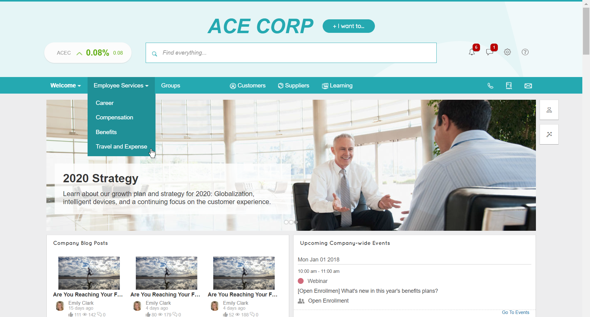

# SAP Jam Collaboration Custom Header Sample

# Introduction
This sample is a custom header that provides an interactive branded experience for SAP Jam Collaboration. It uses HTML, CSS, Bootstrap, custom Javascript libraries, and a stock-ticker gadget to accomplish this. The stock-ticker gadget also uses a third-party library that gets stock-ticker data from a third-party service (Alpha Vantage - https://www.alphavantage.co).

Use of the Alpha Vantage library and service is subject to applicable terms and conditions set out by Alpha Vantage. SAP does not make any representations or warranties respecting the Alpha Vantage library and service and SAP is not liable to you or any third party in respect of any use of the Alpha Vantage library and service.

To use this sample simply:
* Copy and paste this into the custom header of your SAP Jam Collaboration instance.
* Follow the in-line documentation in the sample.
* Use the Custom Header reference documentation located here:
  * [Configure the Branding and Support options](https://help.sap.com/viewer/u_admin_help/b1cf4e797d4a1014ba05827eb0e91070.html)
  * [Best practices for custom headers](https://help.sap.com/viewer/u_admin_help/4099c60a71684aa18124604a1a4fe3a6.html)

# License
Copyright 2014, SAP AG

Licensed under the Apache License, Version 2.0 (the "License");
you may not use this file except in compliance with the License.
You may obtain a copy of the License at

   http://www.apache.org/licenses/LICENSE-2.0

Unless required by applicable law or agreed to in writing, software
distributed under the License is distributed on an "AS IS" BASIS,
WITHOUT WARRANTIES OR CONDITIONS OF ANY KIND, either express or implied.
See the License for the specific language governing permissions and
limitations under the License.

